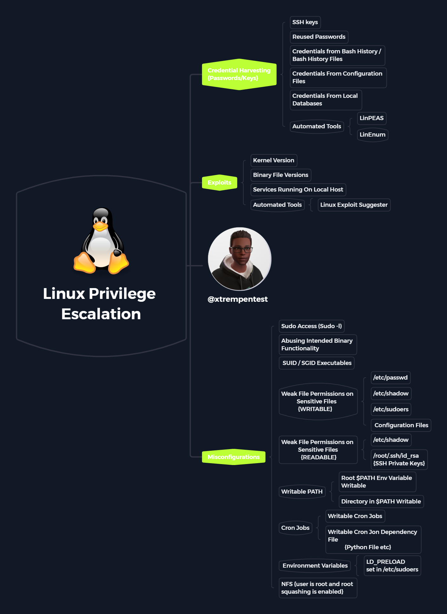

# Linux-Privilege-Escalation-MindMap
OSCP Privilege Escalation MindMap/Guide

<h4 align="left">Connect with me:</h4>

[](https://twitter.com/xtremepentest)
[](https://twitter.com/0xTRAW)

_**The MindMaps comes in different formats and there are located in the MindMaps folder**_

Supported Formats:
- png
- svg
- docx
- md
- xlsx
- opml
- pdf

## Credential Harvesting {Passwords/Keys}

- SSH keys

- Reused Passwords

- Credentials from Bash History / Bash History Files

- Credentials From Configuration Files

- Credentials From Local Databases

#### Automated Tools

- LinPEAS
- LinEnum

## Exploits

- Kernel Version

- Binary File Versions

- Services Running On Local Host

#### Automated Tools

- Linux Exploit Suggester

## Misconfigurations

- Sudo Access (Sudo -l)

- Abusing Intended Binary Functionality

- SUID / SGID Executables

### Weak File Permissions on Sensitive Files

                         {WRITABLE}

- /etc/passwd
- /etc/shadow
- /etc/sudoers
- Configuration Files

### Weak File Permissions on Sensitive Files

                         {READABLE}

- /etc/shadow
- /root/.ssh/id_rsa {SSH Private Keys}

### Writable PATH

- Root $PATH Env Variable Writable
- Directory in $PATH Writable

### Cron Jobs

- Writable Cron Jobs
- Writable Cron Jon Dependency File
  
            {Python File etc}

### Environment Variables

- LD_PRELOAD set in /etc/sudoers

### NFS {user is root and root squashing is enabled}

# Sponsor this project

**Bitcoin Address**
```
bc1q33ncrxzpuc5n02dc05kl44vpmaw53wf3ztq78q
```
**Etherium Address**
```
0x1c9155bc825CBa45B64741f2E33069d6808AdD92
```
**Litecoin Address**
```
LRvPjCq3ZNunLz3bnSc4wz4FDJF8AZUJLK
```
